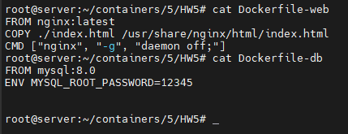
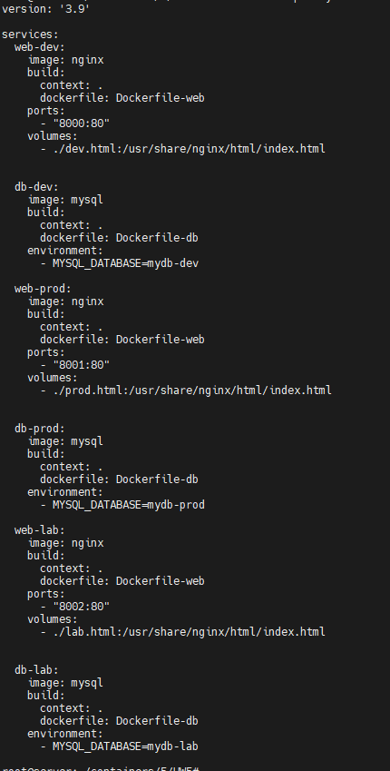
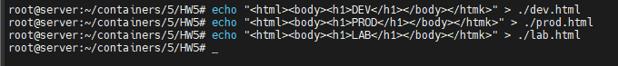
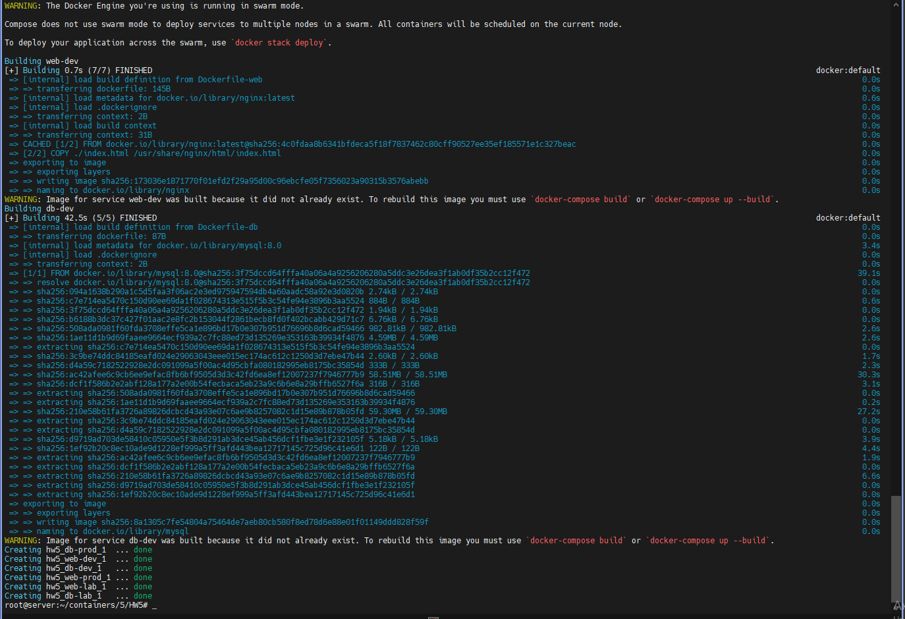
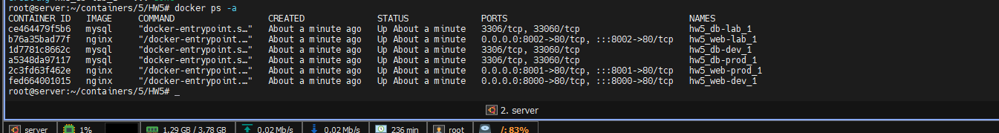
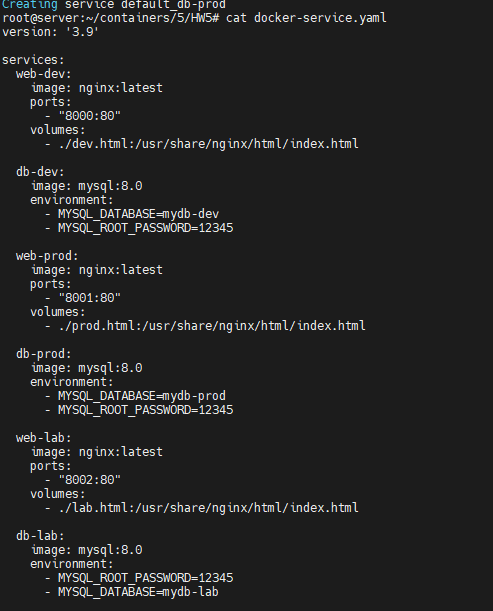
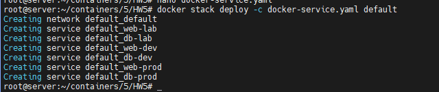
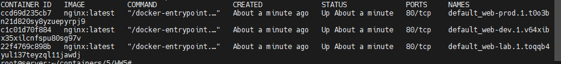
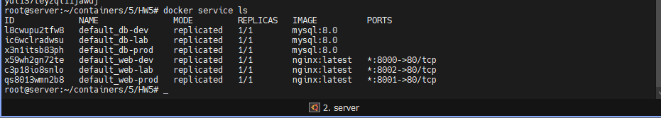
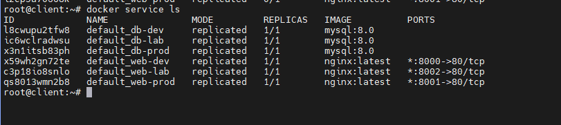

# Docker Compose & Docker Swarm 
## Домашней задачи 5
Задание 1:
1) создать сервис, состоящий из 2 различных контейнеров: 1 - веб, 2 - БД
2) далее необходимо создать 3 сервиса в каждом окружении (dev, prod, lab)
3) по итогу на каждой ноде должно быть по 2 работающих контейнера
4) выводы зафиксировать

Установил связи между сервера и клиент при Swarm.

Создал два Dockerfile для веб-контейнера и БД-контейнера.

Создал файл docker-compose.yaml, в котором описвыаеются сервисы для двух контейнеров и сами окружения dev, prod, lab.
В docker-compose.yaml нужно прописать 3 сервиса: web-dev, db-dev, web-prod, db-prod, web-lab, db-lab.

Создал файл dev.html, prod.html, lab.html , в которых описываеются название по каждому файлу.

Запускаем Docker Compose командой docker-compose up -d для создания и запуска контейнеров.

Проверяем, что на каждой ноде есть по 2 работающих контейнера. Для этого используем команду docker ps.

Вышел из docker-compose.Создал файл docker-compose.yaml для SWARM, в котором описвыаеются сервисы для двух контейнеров и сами окружения dev, prod, lab.
В docker-compose-service.yaml нужно прописать 3 сервиса: web-dev, db-dev, web-prod, db-prod, web-lab, db-lab.

Создал сервисе при stack командой docker stack deploy --c docker-compose-service.yaml default

Проверяем, что на каждой ноде есть по 2 работающих контейнера. Для этого используем команду docker ps.

